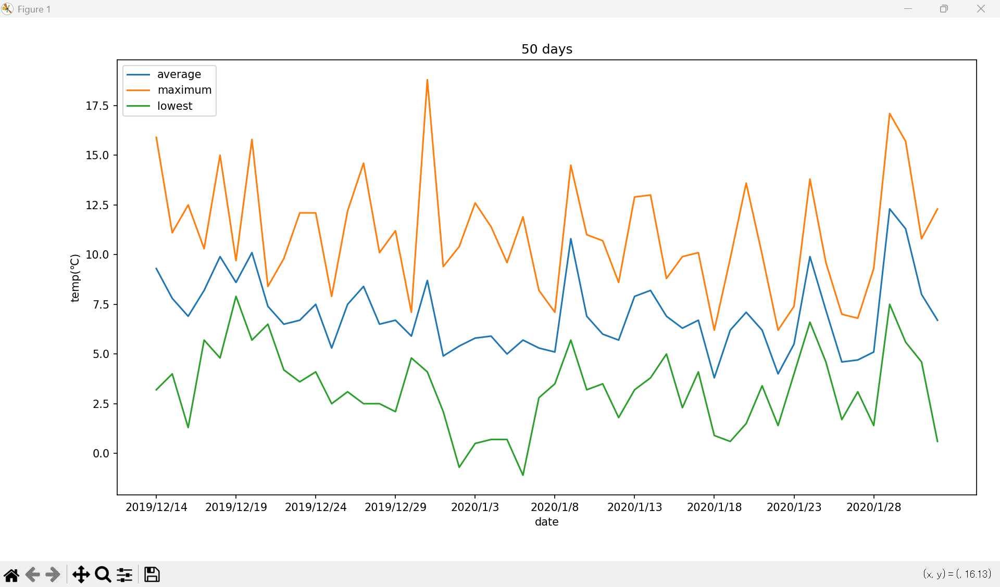

## Exercises（演習問題）

### 目次

1. [データの読み込み](#01)
1. [データの中身確認（先頭行、末尾行）](#02)
1. [不要な列、行の削除](#03)
1. [データの型、サイズ、列名、行名の確認](#04)
1. [任意の要素を取得](#05)
1. [条件抽出](#06)
1. [ユニークな値の抽出](#07)
1. [重複除去](#08)
1. [カラム名変更](#09)
1. [並び替え](#10)
1. [ダミー変数への処理](#11)
1. [欠損値の確認](#12)
1. [欠損値の補完](#13)
1. [欠損値の削除](#14)
1. [ユニークな値と出現回数](#15)
1. [グループ毎の集計](#16)
1. [統計量の確認](#17)
1. [折れ線グラフの表示](#18)
1. [](#19)
1. [](#20)

<a id="01"></a>

### 1.データの読み込み

`weather.csv`を読み込みdfで定義する

exercises/main.py
```
import pandas as pd

def main():
    csv_file = "./datas/weather.csv"
    df = pd.read_csv(csv_file, sep=",")
    print(df)

if __name__ == "__main__":
    main()
```

`main.py`実行結果
```
            年月日  平均気温(℃) 平均気温(℃).1 平均気温(℃).2  最高気温(℃)  ... 平均風速(m/s).1 平均風速(m/s).2  日照時間(時間) 日照時間(時間).1 日照時間(時間).2
0           NaN      NaN      品質情報      均質番号      NaN  ...        品質情報        均質番号       NaN       品質情報       均質番号
1    2019/12/14      9.3         8         1     15.9  ...           8           1       8.9          8          1
2    2019/12/15      7.8         8         1     11.1  ...           8           1       6.3          8          1
3    2019/12/16      6.9         8         1     12.5  ...           8           1       8.9          8          1
4    2019/12/17      8.2         8         1     10.3  ...           8           1       0.2          8          1
..          ...      ...       ...       ...      ...  ...         ...         ...       ...        ...        ...
363  2020/12/10      8.7         8         1     11.1  ...           8           1       0.0          8          1
364  2020/12/11      9.2         8         1     13.8  ...           8           1       4.3          8          1
365  2020/12/12     10.4         8         1     14.0  ...           8           1       1.4          8          1
366  2020/12/13      8.6         8         1     14.4  ...           8           1       5.5          8          1
367  2020/12/14      7.8         8         1     12.2  ...           8           1       4.4          8          1

[368 rows x 28 columns]
```
<a id="02"></a>

### 2. データの中身確認（先頭行、末尾行）

読み込んだデータdfの先頭3行、末尾10行を表示する

exercises/main.py
```
import pandas as pd

def main():
    csv_file = "./datas/weather.csv"
    df = pd.read_csv(csv_file, sep=",")
    
    print(df.head(3))
    print(df.tail(10))

if __name__ == "__main__":
    main()
```

`main.py`実行結果
```
          年月日  平均気温(℃) 平均気温(℃).1 平均気温(℃).2  最高気温(℃) 最高気温(℃).1 最高気温(℃).2  ...  平均蒸気圧(hPa).2 平均風速(m/s) 平均風速(m/s).1  平均風速(m/s).2 日照時間(時間) 日照時間(時間).1  日照時間(時間).2
0         NaN      NaN      品質情報      均質番号      NaN      品質情報      均質番号  ...          均質番号       NaN        品質情報         均質番号      NaN       品質情報        均質番号
1  2019/12/14      9.3         8         1     15.9         8         1  ...             1       2.0           8            1      8.9          8           1
2  2019/12/15      7.8         8         1     11.1         8         1  ...             1       2.3           8            1      6.3          8           1

[3 rows x 28 columns]
            年月日  平均気温(℃) 平均気温(℃).1 平均気温(℃).2  最高気温(℃) 最高気温(℃).1 最高気温(℃).2  ...  平均蒸気圧(hPa).2 平均風速(m/s) 平均風速(m/s).1  平均風速(m/s).2 日照時間(時間) 日照時間(時間).1  日照時間(時間).2
358   2020/12/5      6.0         8         1      7.3         8         1  ...             1       1.4           8            1      0.0          8           1
359   2020/12/6      8.0         8         1     13.3         8         1  ...             1       1.0           8            1      3.8          8           1
360   2020/12/7      9.0         8         1     16.0         8         1  ...             1       0.7           8            1      9.0          8           1
361   2020/12/8     10.4         8         1     16.0         8         1  ...             1       1.3           8            1      6.9          8           1
362   2020/12/9      9.2         8         1     11.2         8         1  ...             1       1.4           8            1      0.0          8           1
363  2020/12/10      8.7         8         1     11.1         8         1  ...             1       1.4           8            1      0.0          8           1
364  2020/12/11      9.2         8         1     13.8         8         1  ...             1       0.8           8            1      4.3          8           1
365  2020/12/12     10.4         8         1     14.0         8         1  ...             1       1.4           8            1      1.4          8           1
366  2020/12/13      8.6         8         1     14.4         8         1  ...             1       1.0           8            1      5.5          8           1
367  2020/12/14      7.8         8         1     12.2         8         1  ...             1       1.9           8            1      4.4          8           1

[10 rows x 28 columns]
```

<a id="03"></a>

### 3. 不要な列、行の削除

先頭行と「〇〇．１」「〇〇．２」となっているカラム名（列名）を削除したDataFrame`df`を再定義する

exercises/main.py
```
import pandas as pd

def main():
    csv_file = "./datas/weather.csv"
    df = pd.read_csv(csv_file, sep=",")
    
    df = df[[
        '年月日', 
        '平均気温(℃)',
        '最高気温(℃)', 
        '最低気温(℃)',
        '降水量の合計(mm)',
        '最深積雪(cm)',
        '平均雲量(10分比)',
        '平均蒸気圧(hPa)',
        '平均風速(m/s)',
        '日照時間(時間)'
    ]][1:]
    print(df)

if __name__ == "__main__":
    main()
```

`main.py`実行結果
```
     年月日  平均気温(℃)  最高気温(℃)  最低気温(℃)  降水量の合計(mm)  最深積雪(cm)  平均雲量(10分比)  平均蒸気圧(hPa)  平均風速(m/s)  日照時間(時間)
1    2019/12/14      9.3     15.9      3.2         0.0       NaN         NaN         NaN        2.0       8.9
2    2019/12/15      7.8     11.1      4.0         0.0       NaN         NaN         NaN        2.3       6.3
3    2019/12/16      6.9     12.5      1.3         0.0       NaN         NaN         NaN        1.1       8.9
4    2019/12/17      8.2     10.3      5.7         2.0       NaN         NaN         NaN        1.1       0.2
5    2019/12/18      9.9     15.0      4.8         0.0       NaN         NaN         NaN        1.2       4.3
..          ...      ...      ...      ...         ...       ...         ...         ...        ...       ...
363  2020/12/10      8.7     11.1      6.0         0.5       NaN         NaN         NaN        1.4       0.0
364  2020/12/11      9.2     13.8      3.5         0.0       NaN         NaN         NaN        0.8       4.3
365  2020/12/12     10.4     14.0      8.0         0.0       NaN         NaN         NaN        1.4       1.4
366  2020/12/13      8.6     14.4      4.4         0.0       NaN         NaN         NaN        1.0       5.5
367  2020/12/14      7.8     12.2      4.4         0.0       NaN         NaN         NaN        1.9       4.4

[367 rows x 10 columns]
```

#### 解説

1. 抽出したいカラム名を配列で作成する

    `df.columns`：DataFrameの全カラム名を表示する
    ```
    print(df.columns)
    ```

    実行結果
    ```
    Index(['年月日', '平均気温(℃)', '平均気温(℃).1', '平均気温(℃).2', '最高気温(℃)', '最高気温(℃).1',
       '最高気温(℃).2', '最低気温(℃)', '最低気温(℃).1', '最低気温(℃).2', '降水量の合計(mm)',
       '降水量の合計(mm).1', '降水量の合計(mm).2', '最深積雪(cm)', '最深積雪(cm).1', '最深積雪(cm).2',
       '平均雲量(10分比)', '平均雲量(10分比).1', '平均雲量(10分比).2', '平均蒸気圧(hPa)',
       '平均蒸気圧(hPa).1', '平均蒸気圧(hPa).2', '平均風速(m/s)', '平均風速(m/s).1',
       '平均風速(m/s).2', '日照時間(時間)', '日照時間(時間).1', '日照時間(時間).2'],
      dtype='str')
    ```

    抽出したいカラム名を配列に設定する
    ```
    [
        '年月日', 
        '平均気温(℃)',
        '最高気温(℃)', 
        '最低気温(℃)',
        '降水量の合計(mm)',
        '最深積雪(cm)',
        '平均雲量(10分比)',
        '平均蒸気圧(hPa)',
        '平均風速(m/s)',
        '日照時間(時間)'
    ]
    ```

2. `df[]`に配列を`df`に設定し`head`でデータを5行抽出する

    ```
    df = df[[
        '年月日', 
        '平均気温(℃)',
        '最高気温(℃)', 
        '最低気温(℃)',
        '降水量の合計(mm)',
        '最深積雪(cm)',
        '平均雲量(10分比)',
        '平均蒸気圧(hPa)',
        '平均風速(m/s)',
        '日照時間(時間)'
    ]]
    print(df.head())
    ```

    実行結果
    ```
              年月日  平均気温(℃)  最高気温(℃)  最低気温(℃)  降水量の合計(mm)  最深積雪(cm)  平均雲量(10分比)  平均蒸気圧(hPa)  平均風速(m/s)  日照時間(時間)
    0         NaN      NaN      NaN      NaN         NaN       NaN         NaN         NaN        NaN       NaN
    1  2019/12/14      9.3     15.9      3.2         0.0       NaN         NaN         NaN        2.0       8.9
    2  2019/12/15      7.8     11.1      4.0         0.0       NaN         NaN         NaN        2.3       6.3
    3  2019/12/16      6.9     12.5      1.3         0.0       NaN         NaN         NaN        1.1       8.9
    4  2019/12/17      8.2     10.3      5.7         2.0       NaN         NaN         NaN        1.1       0.2
    ```

3. 不要な行、0番目の除いた1番目からとする

    ```
    print(df[1:])
    ```

    実行結果
    ```
                年月日  平均気温(℃)  最高気温(℃)  最低気温(℃)  降水量の合計(mm)  最深積雪(cm)  平均雲量(10分比)  平均蒸気圧(hPa)  平均風速(m/s)  日照時間(時間)
    1    2019/12/14      9.3     15.9      3.2         0.0       NaN         NaN         NaN        2.0       8.9
    2    2019/12/15      7.8     11.1      4.0         0.0       NaN         NaN         NaN        2.3       6.3
    3    2019/12/16      6.9     12.5      1.3         0.0       NaN         NaN         NaN        1.1       8.9
    4    2019/12/17      8.2     10.3      5.7         2.0       NaN         NaN         NaN        1.1       0.2
    5    2019/12/18      9.9     15.0      4.8         0.0       NaN         NaN         NaN        1.2       4.3
    ..          ...      ...      ...      ...         ...       ...         ...         ...        ...       ...
    363  2020/12/10      8.7     11.1      6.0         0.5       NaN         NaN         NaN        1.4       0.0
    364  2020/12/11      9.2     13.8      3.5         0.0       NaN         NaN         NaN        0.8       4.3
    365  2020/12/12     10.4     14.0      8.0         0.0       NaN         NaN         NaN        1.4       1.4
    366  2020/12/13      8.6     14.4      4.4         0.0       NaN         NaN         NaN        1.0       5.5
    367  2020/12/14      7.8     12.2      4.4         0.0       NaN         NaN         NaN        1.9       4.4

    [367 rows x 10 columns]
    ```

<a id="04"></a>

### 4. データの型、サイズ、列名、行名の確認

下記の値を取得する
- 各列のデータ型：`df.dtypes`
- DataFrameのサイズ：`df.shape`
- 列名：`df.columns`
- 行名：`df.index`

exercises/main.py
```
import pandas as pd

def main():
    csv_file = "./datas/weather.csv"
    df = pd.read_csv(csv_file, sep=",")
    df = df[[
        '年月日', 
        '平均気温(℃)',
        '最高気温(℃)', 
        '最低気温(℃)',
        '降水量の合計(mm)',
        '最深積雪(cm)',
        '平均雲量(10分比)',
        '平均蒸気圧(hPa)',
        '平均風速(m/s)',
        '日照時間(時間)'
    ]][1:]
    print(df.dtypes)
    print(df.shape)
    print(df.columns)
    print(df.index)

if __name__ == "__main__":
    main()
```

`main.py`実行結果
```
年月日               str
平均気温(℃)       float64
最高気温(℃)       float64
最低気温(℃)       float64
降水量の合計(mm)    float64
最深積雪(cm)      float64
平均雲量(10分比)    float64
平均蒸気圧(hPa)    float64
平均風速(m/s)     float64
日照時間(時間)      float64
dtype: object
(367, 10)
Index(['年月日', '平均気温(℃)', '最高気温(℃)', '最低気温(℃)', '降水量の合計(mm)', '最深積雪(cm)',
       '平均雲量(10分比)', '平均蒸気圧(hPa)', '平均風速(m/s)', '日照時間(時間)'],
      dtype='str')
RangeIndex(start=1, stop=368, step=1)
```

<a id="05"></a>

### 5. 任意の要素を取得

dfの5～10行目、3～6列目（最高気温(℃)～最深積雪(cm)）の要素を取得する

- `df.iloc(row_num:column_num)`を使用した場合

    exercises/main.py
    ```
    import pandas as pd

    def main():
        csv_file = "./datas/weather.csv"
        df = pd.read_csv(csv_file, sep=",")
        df = df[[
            '年月日', 
            '平均気温(℃)',
            '最高気温(℃)', 
            '最低気温(℃)',
            '降水量の合計(mm)',
            '最深積雪(cm)',
            '平均雲量(10分比)',
            '平均蒸気圧(hPa)',
            '平均風速(m/s)',
            '日照時間(時間)'
        ]][1:]
        print(df.iloc[4:10, 2:6])

    if __name__ == "__main__":を使用した場合
        main()
    ```

    `main.py`実行結果
    ```
        最高気温(℃)  最低気温(℃)  降水量の合計(mm)  最深積雪(cm)
    5      15.0      4.8         0.0       NaN
    6       9.7      7.9         1.0       NaN
    7      15.8      5.7         0.0       NaN
    8       8.4      6.5         0.0       NaN
    9       9.8      4.2        21.0       NaN
    10     12.1      3.6         9.5       NaN
    ```

- `df.loc(row_num:column_name)`を使用した場合

    exercises/main.py
    ```
    import pandas as pd

    def main():
        csv_file = "./datas/weather.csv"
        df = pd.read_csv(csv_file, sep=",")
        df = df[[
            '年月日', 
            '平均気温(℃)',
            '最高気温(℃)', 
            '最低気温(℃)',
            '降水量の合計(mm)',
            '最深積雪(cm)',
            '平均雲量(10分比)',
            '平均蒸気圧(hPa)',
            '平均風速(m/s)',
            '日照時間(時間)'
        ]][1:]
        print(df.loc[5:10, '最高気温(℃)':'最深積雪(cm)'])

    if __name__ == "__main__":
        main()
    ```

    `main.py`実行結果
    ```
        最高気温(℃)  最低気温(℃)  降水量の合計(mm)  最深積雪(cm)
    5      15.0      4.8         0.0       NaN
    6       9.7      7.9         1.0       NaN
    7      15.8      5.7         0.0       NaN
    8       8.4      6.5         0.0       NaN
    9       9.8      4.2        21.0       NaN
    10     12.1      3.6         9.5       NaN
    ```

<a id="06"></a>

### 6. 条件抽出

`people.csv`を読み込み`df_people`と定義し下記条件を満たすDataFrameをそれぞれ抽出する
- nationalityがAmericaである
- ageが20以上30未満である

exercises/main.py
```
import pandas as pd

def main():
    csv_file_people = "./datas/people.csv"
    df_people = pd.read_csv(csv_file_people, sep=",")

    print(df_people[df_people["nationality"] == "America"])
    print(df_people.query("nationality == 'America'"))
    print(df_people[df_people["nationality"].isin(["America"])])

    print(df_people[(df_people["age"] >= 20) & (df_people["age"] < 30)])
    print(df_people.query("age >= 20 & age < 30"))

if __name__ == "__main__":
    main()
```

`main.py`実行結果
```
   age  id  name nationality
1   21  33  Mike     America
3   16  20  John     America
   age  id  name nationality
1   21  33  Mike     America
3   16  20  John     America
   age  id  name nationality
1   21  33  Mike     America
3   16  20  John     America
   age  id      name nationality
0   26  13  Imanishi       Japan
1   21  33      Mike     America
4   28  11       Kim       Korea
   age  id      name nationality
0   26  13  Imanishi       Japan
1   21  33      Mike     America
4   28  11       Kim       Korea
```

<a id="07"></a>

### 7. ユニークな値の抽出

`df_people`に対してカラム毎のユニーク（固有）な値を抽出する

exercises/main.py
```
import pandas as pd

def main():
    csv_file_people = "./datas/people.csv"
    df_people = pd.read_csv(csv_file_people, sep=",")

    print(df_people["name"].unique())
    print(df_people["nationality"].unique())

if __name__ == "__main__":
    main()
```

`main.py`実行結果
```
<StringArray>
['Imanishi', 'Mike', 'Suzuki', 'John', 'Kim']
Length: 5, dtype: str
<StringArray>
['Japan', 'America', 'Korea']
Length: 3, dtype: str
```

<a id="08"></a>

### 8. 重複除去

`df_people`の`nationality`の列に対して重複のデータを除去したDataFrameを取得する

exercises/main.py
```
import pandas as pd

def main():
    csv_file_people = "./datas/people.csv"
    df_people = pd.read_csv(csv_file_people, sep=",")

    print(df_people.drop_duplicates(subset="nationality"))

if __name__ == "__main__":
    main()
```

`main.py`実行結果
```
   age  id      name nationality
0   26  13  Imanishi       Japan
1   21  33      Mike     America
4   28  11       Kim       Korea
```

<a id="09"></a>

### 9. カラム名変更

dfに対し各カラム名の「（単位）」部分を削除したカラム名に変更する

- `df.rename(columns={})`：カラム名を変更する場合

    exercises/main.py
    ```
    import pandas as pd

    def main():
        csv_file = "./datas/weather.csv"
        df = pd.read_csv(csv_file, sep=",")
        df = df[['年月日','平均気温(℃)','最高気温(℃)', '最低気温(℃)','降水量の合計(mm)','最深積雪(cm)','平均雲量(10分比)','平均蒸気圧(hPa)','平均風速(m/s)', '日照時間(時間)']]
        df = df.rename(columns={
            '平均気温(℃)':'平均気温',
            '最高気温(℃)':'最高気温', 
            '最低気温(℃)':'最低気温',
            '降水量の合計(mm)':'降水量の合計',
            '最深積雪(cm)':'最深積雪',
            '平均雲量(10分比)':'平均雲量',
            '平均蒸気圧(hPa)':'平均蒸気圧',
            '平均風速(m/s)':'平均風速',
            '日照時間(時間)':'日照時間'
        })[1:]
        print(df)

    if __name__ == "__main__":
        main()
    ```

    `main.py`実行結果
    ```
                年月日  平均気温  最高気温  最低気温  降水量の合計  最深積雪  平均雲量  平均蒸気圧  平均風速  日照時間
    1    2019/12/14   9.3  15.9   3.2     0.0   NaN   NaN    NaN   2.0   8.9
    2    2019/12/15   7.8  11.1   4.0     0.0   NaN   NaN    NaN   2.3   6.3
    3    2019/12/16   6.9  12.5   1.3     0.0   NaN   NaN    NaN   1.1   8.9
    4    2019/12/17   8.2  10.3   5.7     2.0   NaN   NaN    NaN   1.1   0.2
    ..          ...   ...   ...   ...     ...   ...   ...    ...   ...   ...
    363  2020/12/10   8.7  11.1   6.0     0.5   NaN   NaN    NaN   1.4   0.0
    364  2020/12/11   9.2  13.8   3.5     0.0   NaN   NaN    NaN   0.8   4.3
    365  2020/12/12  10.4  14.0   8.0     0.0   NaN   NaN    NaN   1.4   1.4
    366  2020/12/13   8.6  14.4   4.4     0.0   NaN   NaN    NaN   1.0   5.5
    367  2020/12/14   7.8  12.2   4.4     0.0   NaN   NaN    NaN   1.9   4.4

    [368 rows x 10 columns]
    ```

- `df.columns = [columns_name]`：カラム名を代入する場合
    
    exercises/main.py
    ```
    import pandas as pd

    def main():
        csv_file = "./datas/weather.csv"
        df = pd.read_csv(csv_file, sep=",")
        df = df[['年月日','平均気温(℃)','最高気温(℃)', '最低気温(℃)','降水量の合計(mm)','最深積雪(cm)','平均雲量(10分比)','平均蒸気圧(hPa)','平均風速(m/s)', '日照時間(時間)']][1:]
        df.columns = ['年月日','平均気温','最高気温', '最低気温','降水量の合計','最深積雪','平均雲量','平均蒸気圧','平均風速', '日照時間']
        print(df)

    if __name__ == "__main__":
        main()
    ```

    `main.py`実行結果
    ```
                年月日  平均気温  最高気温  最低気温  降水量の合計  最深積雪  平均雲量  平均蒸気圧  平均風速  日照時間
    1    2019/12/14   9.3  15.9   3.2     0.0   NaN   NaN    NaN   2.0   8.9
    2    2019/12/15   7.8  11.1   4.0     0.0   NaN   NaN    NaN   2.3   6.3
    3    2019/12/16   6.9  12.5   1.3     0.0   NaN   NaN    NaN   1.1   8.9
    4    2019/12/17   8.2  10.3   5.7     2.0   NaN   NaN    NaN   1.1   0.2
    5    2019/12/18   9.9  15.0   4.8     0.0   NaN   NaN    NaN   1.2   4.3
    ..          ...   ...   ...   ...     ...   ...   ...    ...   ...   ...
    363  2020/12/10   8.7  11.1   6.0     0.5   NaN   NaN    NaN   1.4   0.0
    364  2020/12/11   9.2  13.8   3.5     0.0   NaN   NaN    NaN   0.8   4.3
    365  2020/12/12  10.4  14.0   8.0     0.0   NaN   NaN    NaN   1.4   1.4
    366  2020/12/13   8.6  14.4   4.4     0.0   NaN   NaN    NaN   1.0   5.5
    367  2020/12/14   7.8  12.2   4.4     0.0   NaN   NaN    NaN   1.9   4.4

    [367 rows x 10 columns]
    ```

<a id="10"></a>

### 10. 並び替え

dfを最高気温が高い順に並び替える

exercises/main.py
```
import pandas as pd

def main():
    csv_file = "./datas/weather.csv"
    df = pd.read_csv(csv_file, sep=",")
    df = df[['年月日','平均気温(℃)','最高気温(℃)', '最低気温(℃)','降水量の合計(mm)','最深積雪(cm)','平均雲量(10分比)','平均蒸気圧(hPa)','平均風速(m/s)', '日照時間(時間)']][1:]
    df.columns = ['年月日','平均気温','最高気温', '最低気温','降水量の合計','最深積雪','平均雲量','平均蒸気圧','平均風速', '日照時間']
    print(df.sort_values("最高気温", ascending=False))

if __name__ == "__main__":
    main()
```

`main.py`実行結果
```
           年月日  平均気温  最高気温  最低気温  降水量の合計  最深積雪  平均雲量  平均蒸気圧  平均風速  日照時間
248  2020/8/17  30.9  37.2  26.8     0.0   NaN   NaN    NaN   1.7   9.4
244  2020/8/13  30.4  37.1  26.9     0.5   NaN   NaN    NaN   1.6   8.5
246  2020/8/15  31.2  36.5  27.8     0.0   NaN   NaN    NaN   1.5   8.7
243  2020/8/12  30.3  35.9  27.6     0.0   NaN   NaN    NaN   1.8   7.2
241  2020/8/10  29.6  35.4  25.9     0.0   NaN   NaN    NaN   1.6   6.8
..         ...   ...   ...   ...     ...   ...   ...    ...   ...   ...
44   2020/1/26   4.6   7.0   1.7     5.5   NaN   NaN    NaN   0.9   0.0
45   2020/1/27   4.7   6.8   3.1     3.5   NaN   NaN    NaN   1.6   0.0
36   2020/1/18   3.8   6.2   0.9     7.5   NaN   NaN    NaN   2.5   0.0
40   2020/1/22   4.0   6.2   1.4     0.0   NaN   NaN    NaN   1.2   0.9
55    2020/2/6   2.3   5.5  -1.3     0.0   NaN   NaN    NaN   3.6   7.5

[367 rows x 10 columns]
```

<a id="11"></a>

### 11. ダミー変数への処理

`df_people`の`nationality`カラムをダミー変数に格納する


exercises/main.py
```
import pandas as pd

def main():
    csv_file = "./datas/people.csv"
    df = pd.read_csv(csv_file, sep=",")
    df = pd.get_dummies(df, columns=["nationality"])
    print(df)

if __name__ == "__main__":
    main()
```

`main.py`実行結果
```
   age  id      name  nationality_America  nationality_Japan  nationality_Korea
0   26  13  Imanishi                False               True              False
1   21  33      Mike                 True              False              False
2   35  31    Suzuki                False               True              False
3   16  20      John                 True              False              False
4   28  11       Kim                False              False               True
```

<a id="12"></a>

### 12. 欠損値の確認

dfの欠損値（値が入っていない要素）を確認してください

exercises/main.py
```
import pandas as pd

def main():
    csv_file = "./datas/weather.csv"
    df = pd.read_csv(csv_file, sep=",")
    df = df[['年月日','平均気温(℃)','最高気温(℃)', '最低気温(℃)','降水量の合計(mm)','最深積雪(cm)','平均雲量(10分比)','平均蒸気圧(hPa)','平均風速(m/s)', '日照時間(時間)']][1:]
    df.columns = ['年月日','平均気温','最高気温', '最低気温','降水量の合計','最深積雪','平均雲量','平均蒸気圧','平均風速', '日照時間']
    print(df.isnull())

if __name__ == "__main__":
    main()
```

`main.py`実行結果
```
       年月日   平均気温   最高気温   最低気温  降水量の合計  最深積雪  平均雲量  平均蒸気圧   平均風速   日照時間
1    False  False  False  False   False  True  True   True  False  False
2    False  False  False  False   False  True  True   True  False  False
3    False  False  False  False   False  True  True   True  False  False
4    False  False  False  False   False  True  True   True  False  False
5    False  False  False  False   False  True  True   True  False  False
..     ...    ...    ...    ...     ...   ...   ...    ...    ...    ...
363  False  False  False  False   False  True  True   True  False  False
364  False  False  False  False   False  True  True   True  False  False
365  False  False  False  False   False  True  True   True  False  False
366  False  False  False  False   False  True  True   True  False  False
367  False  False  False  False   False  True  True   True  False  False

[367 rows x 10 columns]
```

<a id="13"></a>

### 13. 欠損値の補完

dfの欠損値をすべて0に置き換える

exercises/main.py
```
import pandas as pd

def main():
    csv_file = "./datas/weather.csv"
    df = pd.read_csv(csv_file, sep=",")
    df = df[['年月日','平均気温(℃)','最高気温(℃)', '最低気温(℃)','降水量の合計(mm)','最深積雪(cm)','平均雲量(10分比)','平均蒸気圧(hPa)','平均風速(m/s)', '日照時間(時間)']][1:]
    df.columns = ['年月日','平均気温','最高気温', '最低気温','降水量の合計','最深積雪','平均雲量','平均蒸気圧','平均風速', '日照時間']
    print(df.fillna(0))

if __name__ == "__main__":
    main()
```

`main.py`実行結果
```
           年月日  平均気温  最高気温  最低気温  降水量の合計  最深積雪  平均雲量  平均蒸気圧  平均風速  日照時間
1    2019/12/14   9.3  15.9   3.2     0.0   0.0   0.0    0.0   2.0   8.9
2    2019/12/15   7.8  11.1   4.0     0.0   0.0   0.0    0.0   2.3   6.3
3    2019/12/16   6.9  12.5   1.3     0.0   0.0   0.0    0.0   1.1   8.9
4    2019/12/17   8.2  10.3   5.7     2.0   0.0   0.0    0.0   1.1   0.2
5    2019/12/18   9.9  15.0   4.8     0.0   0.0   0.0    0.0   1.2   4.3
..          ...   ...   ...   ...     ...   ...   ...    ...   ...   ...
363  2020/12/10   8.7  11.1   6.0     0.5   0.0   0.0    0.0   1.4   0.0
364  2020/12/11   9.2  13.8   3.5     0.0   0.0   0.0    0.0   0.8   4.3
365  2020/12/12  10.4  14.0   8.0     0.0   0.0   0.0    0.0   1.4   1.4
366  2020/12/13   8.6  14.4   4.4     0.0   0.0   0.0    0.0   1.0   5.5
367  2020/12/14   7.8  12.2   4.4     0.0   0.0   0.0    0.0   1.9   4.4

[367 rows x 10 columns]
```

<a id="14"></a>

### 14. 欠損値の削除

dfの欠損値を列方向で削除する

exercises/main.py
```
import pandas as pd

def main():
    csv_file = "./datas/weather.csv"
    df = pd.read_csv(csv_file, sep=",")
    df = df[['年月日','平均気温(℃)','最高気温(℃)', '最低気温(℃)','降水量の合計(mm)','最深積雪(cm)','平均雲量(10分比)','平均蒸気圧(hPa)','平均風速(m/s)', '日照時間(時間)']][1:]
    df.columns = ['年月日','平均気温','最高気温', '最低気温','降水量の合計','最深積雪','平均雲量','平均蒸気圧','平均風速', '日照時間']
    print(df.shape)
    print(df.isnull().sum())
    print(df.dropna(axis=1))

if __name__ == "__main__":
    main()
```

`main.py`実行結果
```
(367, 10)
年月日         0
平均気温        0
最高気温        0
最低気温        0
降水量の合計      0
最深積雪      367
平均雲量      367
平均蒸気圧     367
平均風速        0
日照時間        0
dtype: int64
            年月日  平均気温  最高気温  最低気温  降水量の合計  平均風速  日照時間
1    2019/12/14   9.3  15.9   3.2     0.0   2.0   8.9
2    2019/12/15   7.8  11.1   4.0     0.0   2.3   6.3
3    2019/12/16   6.9  12.5   1.3     0.0   1.1   8.9
4    2019/12/17   8.2  10.3   5.7     2.0   1.1   0.2
5    2019/12/18   9.9  15.0   4.8     0.0   1.2   4.3
..          ...   ...   ...   ...     ...   ...   ...
363  2020/12/10   8.7  11.1   6.0     0.5   1.4   0.0
364  2020/12/11   9.2  13.8   3.5     0.0   0.8   4.3
365  2020/12/12  10.4  14.0   8.0     0.0   1.4   1.4
366  2020/12/13   8.6  14.4   4.4     0.0   1.0   5.5
367  2020/12/14   7.8  12.2   4.4     0.0   1.9   4.4

[367 rows x 7 columns]
```

#### 解説

- DataFrameのサイズを確認する

    ```
    print(df.shape)
    ```

    行：367、列：10というのがわかる

    ```
    (367, 10)
    ```

- 列削除する場合、その列の値が`NaN`であるか確認する

    ```
    print(df.isnull().sum())
    ```

    「最深積雪」、「平均雲量」、「平均蒸気圧」が全ての行でNaNであることがわかる

    ```
    年月日         0
    平均気温        0
    最高気温        0
    最低気温        0
    降水量の合計      0
    最深積雪      367
    平均雲量      367
    平均蒸気圧     367
    平均風速        0
    日照時間        0
    ```

- `df.dropna(axis=1)`：`axis`を`1`とすると、列に対して`NaN`を削除するとなる。（行の場合は`axis=0`とする）

<a id="15"></a>

### 15. ユニークな値と出現回数

`iris.csv`を読み込み`df_iris`として定義し`df_iris`のClassカラムにおいてユニークな値とその出現回数を確認する

exercises/main.py
```
import pandas as pd

def main():
    csv_file = "./datas/iris.csv"
    df = pd.read_csv(csv_file, sep=",")
    print(df)
    print(df["Class"].unique())
    print(df["Class"].value_counts())

if __name__ == "__main__":
    main()
```

`main.py`実行結果
```
     sepal-length  sepal-width  petal-length  petal-width            Class
0             5.1          3.5           1.4          0.2      Iris-setosa
1             4.9          3.0           1.4          0.2      Iris-setosa
2             4.7          3.2           1.3          0.2      Iris-setosa
3             4.6          3.1           1.5          0.2      Iris-setosa
4             5.0          3.6           1.4          0.2      Iris-setosa
..            ...          ...           ...          ...              ...
151          12.5          3.1           5.1          1.8   Iris-virginica
152          13.4          2.7           5.1          1.8   Iris-virginica
153          13.2          3.2           5.1          1.8  Iris-versicolor
154          15.2          2.3           5.1          1.8  Iris-versicolor
155          14.2          2.4           5.1          1.8  Iris-versicolor

[156 rows x 5 columns]
<StringArray>
['Iris-setosa', 'Iris-versicolor', 'Iris-virginica']
Length: 3, dtype: str
Class
Iris-versicolor    53
Iris-virginica     53
Iris-setosa        50
Name: count, dtype: int64
```

#### 解説

- `df[column_name].unique()`：ユニークな値を確認する
- `df[column_name].value_counts()`：出現回数を確認する

<a id="16"></a>

### 16. グループ毎の集計

`df_iris`の下記各クラスにおける`sepal-length`、`sepal-width`、`patal-length`、`patal-width`の平均値を求める

- `Iris-setosa`
- `Iris-versicolor`
- `Iris-virginca`

exercises/main.py
```
import pandas as pd

def main():
    csv_file = "./datas/iris.csv"
    df = pd.read_csv(csv_file, sep=",")
    print(df)
    print(df.groupby(["Class"]).mean())

if __name__ == "__main__":
    main()
```

`main.py`実行結果
```
     sepal-length  sepal-width  petal-length  petal-width            Class
0             5.1          3.5           1.4          0.2      Iris-setosa
1             4.9          3.0           1.4          0.2      Iris-setosa
2             4.7          3.2           1.3          0.2      Iris-setosa
3             4.6          3.1           1.5          0.2      Iris-setosa
4             5.0          3.6           1.4          0.2      Iris-setosa
..            ...          ...           ...          ...              ...
151          12.5          3.1           5.1          1.8   Iris-virginica
152          13.4          2.7           5.1          1.8   Iris-virginica
153          13.2          3.2           5.1          1.8  Iris-versicolor
154          15.2          2.3           5.1          1.8  Iris-versicolor
155          14.2          2.4           5.1          1.8  Iris-versicolor

[156 rows x 5 columns]
                 sepal-length  sepal-width  petal-length  petal-width
Class                                                                
Iris-setosa          5.004255     3.434000      1.454000     0.244000
Iris-versicolor      6.403774     2.762264      4.307547     1.352830
Iris-virginica       6.937736     2.979245      5.526415     2.013208
```

#### 解説

- `df.groupby(column_name)`：DataFrameをカラム名で集計する
- `df.groupby(column_name).mean()`：特定のカラムの値毎に集計後、他カラムの値の平均値を算出する

<a id="17"></a>

### 17. 統計量の確認

`df_iris`の各カラムにおける下記統計量を算出する
- 平均値
- 最大値
- 最小値
- 中央値
- 標準偏差

exercises/main.py
```
import pandas as pd

def main():
    csv_file = "./datas/iris.csv"
    df = pd.read_csv(csv_file, sep=",")
    print(df)
    print(f"平均値\n{df.groupby(["Class"]).mean()}")
    print(f"最大値\n{df.groupby(["Class"]).max()}")
    print(f"最小値\n{df.groupby(["Class"]).min()}")
    print(f"中央値\n{df.groupby(["Class"]).median()}")
    print(f"標準偏差\n{df.groupby(["Class"]).std()}")

if __name__ == "__main__":
    main()
```

`main.py`実行結果
```
     sepal-length  sepal-width  petal-length  petal-width            Class
0             5.1          3.5           1.4          0.2      Iris-setosa
1             4.9          3.0           1.4          0.2      Iris-setosa
2             4.7          3.2           1.3          0.2      Iris-setosa
3             4.6          3.1           1.5          0.2      Iris-setosa
4             5.0          3.6           1.4          0.2      Iris-setosa
..            ...          ...           ...          ...              ...
151          12.5          3.1           5.1          1.8   Iris-virginica
152          13.4          2.7           5.1          1.8   Iris-virginica
153          13.2          3.2           5.1          1.8  Iris-versicolor
154          15.2          2.3           5.1          1.8  Iris-versicolor
155          14.2          2.4           5.1          1.8  Iris-versicolor

[156 rows x 5 columns]
平均値
                 sepal-length  sepal-width  petal-length  petal-width
Class                                                                
Iris-setosa          5.004255     3.434000      1.454000     0.244000
Iris-versicolor      6.403774     2.762264      4.307547     1.352830
Iris-virginica       6.937736     2.979245      5.526415     2.013208
最大値
                 sepal-length  sepal-width  petal-length  petal-width
Class                                                                
Iris-setosa               5.8          4.4           1.9          0.6
Iris-versicolor          15.2          3.4           5.1          1.8
Iris-virginica           13.4          3.8           6.9          2.5
最小値
                 sepal-length  sepal-width  petal-length  petal-width
Class                                                                
Iris-setosa               4.3          2.3           1.0          0.1
Iris-versicolor           4.9          2.0           3.0          1.0
Iris-virginica            4.9          2.2           4.5          1.4
中央値
                 sepal-length  sepal-width  petal-length  petal-width
Class                                                                
Iris-setosa               5.0          3.4           1.5          0.2
Iris-versicolor           6.0          2.8           4.4          1.3
Iris-virginica            6.5          3.0           5.5          2.0
標準偏差
                 sepal-length  sepal-width  petal-length  petal-width
Class                                                                
Iris-setosa          0.353835     0.377213      0.182063     0.107210
Iris-versicolor      2.001630     0.321192      0.496468     0.221536
Iris-virginica       1.571773     0.321271      0.546017     0.271773
```

#### 解説

- `df.describe()`：カラム毎に表形式で統計量等を出力する

    ```
    print(f"統計量等\n{df.describe()}")
    ```

    ```
    統計量等
           sepal-length  sepal-width  petal-length  petal-width
    count    153.000000   156.000000    156.000000   156.000000
    mean       6.158824     3.051282      3.807051     1.221795
    std        1.702457     0.437955      1.753783     0.757185
    min        4.300000     2.000000      1.000000     0.100000
    25%        5.100000     2.800000      1.600000     0.300000
    50%        5.800000     3.000000      4.400000     1.350000
    75%        6.500000     3.325000      5.100000     1.800000
    max       15.200000     4.400000      6.900000     2.500000
    ```
<a id="18"></a>

### 18. 折れ線グラフの表示

`df`の先頭50日間における平均気温、最高気温、最低気温を折れ線グラフで可視化する

exercises/main.py
```
import pandas as pd
import matplotlib.pyplot as plt

def main():
    csv_file = "./datas/weather.csv"
    df = pd.read_csv(csv_file, sep=",")
    df = df[['年月日', '平均気温(℃)', '最高気温(℃)','最低気温(℃)']][1:51]
    print(df)
    plt.plot(df["年月日"], df['平均気温(℃)'], label="average")
    plt.plot(df["年月日"], df['最高気温(℃)'], label="maximum")
    plt.plot(df["年月日"], df['最低気温(℃)'], label="lowest")
    plt.title("50 days")
    plt.xlabel("date")
    plt.ylabel("temp(℃)")
    plt.xticks(range(0,len(df),5),df["年月日"][::5])
    plt.tight_layout()
    plt.legend()
    plt.show()

if __name__ == "__main__":
    main()
```

`main.py`実行結果
```
           年月日  平均気温(℃)  最高気温(℃)  最低気温(℃)
1   2019/12/14      9.3     15.9      3.2
2   2019/12/15      7.8     11.1      4.0
3   2019/12/16      6.9     12.5      1.3
4   2019/12/17      8.2     10.3      5.7
5   2019/12/18      9.9     15.0      4.8
6   2019/12/19      8.6      9.7      7.9
7   2019/12/20     10.1     15.8      5.7
8   2019/12/21      7.4      8.4      6.5
9   2019/12/22      6.5      9.8      4.2
10  2019/12/23      6.7     12.1      3.6
11  2019/12/24      7.5     12.1      4.1
12  2019/12/25      5.3      7.9      2.5
13  2019/12/26      7.5     12.2      3.1
14  2019/12/27      8.4     14.6      2.5
15  2019/12/28      6.5     10.1      2.5
16  2019/12/29      6.7     11.2      2.1
17  2019/12/30      5.9      7.1      4.8
18  2019/12/31      8.7     18.8      4.1
19    2020/1/1      4.9      9.4      2.1
20    2020/1/2      5.4     10.4     -0.7
21    2020/1/3      5.8     12.6      0.5
22    2020/1/4      5.9     11.4      0.7
23    2020/1/5      5.0      9.6      0.7
24    2020/1/6      5.7     11.9     -1.1
25    2020/1/7      5.3      8.2      2.8
26    2020/1/8      5.1      7.1      3.5
27    2020/1/9     10.8     14.5      5.7
28   2020/1/10      6.9     11.0      3.2
29   2020/1/11      6.0     10.7      3.5
30   2020/1/12      5.7      8.6      1.8
31   2020/1/13      7.9     12.9      3.2
32   2020/1/14      8.2     13.0      3.8
33   2020/1/15      6.9      8.8      5.0
34   2020/1/16      6.3      9.9      2.3
35   2020/1/17      6.7     10.1      4.1
36   2020/1/18      3.8      6.2      0.9
37   2020/1/19      6.2      9.8      0.6
38   2020/1/20      7.1     13.6      1.5
39   2020/1/21      6.2     10.0      3.4
40   2020/1/22      4.0      6.2      1.4
41   2020/1/23      5.5      7.4      4.0
42   2020/1/24      9.9     13.8      6.6
43   2020/1/25      7.2      9.6      4.6
44   2020/1/26      4.6      7.0      1.7
45   2020/1/27      4.7      6.8      3.1
46   2020/1/28      5.1      9.3      1.4
47   2020/1/29     12.3     17.1      7.5
48   2020/1/30     11.3     15.7      5.6
49   2020/1/31      8.0     10.8      4.6
50    2020/2/1      6.7     12.3      0.6
```



#### 解説

1. 先頭50日間における平均気温、最高気温、最低気温のデータを用意する

    ```
    df = df[['年月日', '平均気温(℃)', '最高気温(℃)','最低気温(℃)']][1:51]
    ```

2. 折れ線グラフの設定
    - `plt.plot(x, y, label_name)`：可視化するデータのX軸とY軸を指定する
    - `plt.title(title_name)`：グラフのタイトルを設定する
    - `plt.xlabel(x_label_name)`：X軸のラベルを設定する
    - `plt.ylabel(y_label_name)`：Y軸のラベルを設定する
    - `plt.xticks()`：X軸の目盛り（ティック）と、そのラベルを設定する
        - 最初の引数：目盛りを表示する位置
            `range(0, len(df), 5)`：5つおきの位置を指定
        - 2番目の引数：その位置に対応するラベル
            `df["年月日"][::5]`：5つおきのラベルを指定
    - `plt.tight_layout()`：ラベルや軸の文字が重ならないように自動で余白を詰める
    - `plt.legend()`：凡例ラベルを付ける
    - `plt.show()`：折れ線グラフで可視化する


<a id="19"></a>

### 19.

exercises/main.py
```
```

`main.py`実行結果
```
```

<a id="20"></a>

### 20.

exercises/main.py
```
```

`main.py`実行結果
```
```